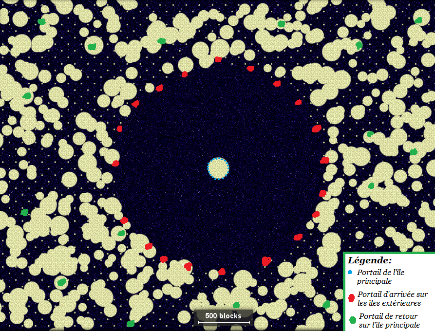

# Coordonnées de l'End

Liste des coordonnées importantes dans l'End. Il existes plusieurs types de portails dans l'End:  
- Le portail principal, situé au centre de l'île principal  
- Les portails situés en bordure de l'île principale, amenant vers les îles externes  
- Les portails situés en bordure des îles externes, amenant vers l'île principale  
- Les portails disséminés de manière aléatoire dans les îles externes, amenant vers l'île principale  

Si le portail n'existe pas encore, la mention `Néant` est apposée. Les coordonnées sont au format `X / Y / Z` ou `X / Z`.

A chaque portail en bordure de l'île principale correspond un portail en bordure des îles externes. Un duo de portail est généré à chaque fois que l'Ender Dragon est tué, le nombre de duos ne pouvant excéder 20.

## Île principale

| Lieu | Coordonnées |
|:-----|:-----------:|
| Portail principal | `?` |
| Plateforme d'obsidienne | `?` |

### Portails vers les îles externes

| Lieu | Coordonnées |
|:-----|:-----------:|
| Portail #1 | `-1 / 75 / 96` |
| Portail #2 | `0 / 75 / -96` |
| Portail #3 | `Néant` |
| Portail #4 | `Néant` |
| Portail #5 | `Néant` |
| Portail #6 | `Néant` |
| Portail #7 | `Néant` |
| Portail #8 | `Néant` |
| Portail #9 | `Néant` |
| Portail #10 | `Néant` |
| Portail #11 | `Néant` |
| Portail #12 | `Néant` |
| Portail #13 | `Néant` |
| Portail #14 | `Néant` |
| Portail #15 | `Néant` |
| Portail #16 | `Néant` |
| Portail #17 | `Néant` |
| Portail #18 | `Néant` |
| Portail #19 | `Néant` |
| Portail #20 | `Néant` |

## Îles externes

### Portails d'arrivées

| Lieu | Coordonnées |
|:-----|:-----------:|
| Portail #1 | `-17 / 69 / 1096` |
| Portail #2 | `-1 / 64 / -977` |
| Portail #3 | `Néant` |
| Portail #4 | `Néant` |
| Portail #5 | `Néant` |
| Portail #6 | `Néant` |
| Portail #7 | `Néant` |
| Portail #8 | `Néant` |
| Portail #9 | `Néant` |
| Portail #10 | `Néant` |
| Portail #11 | `Néant` |
| Portail #12 | `Néant` |
| Portail #13 | `Néant` |
| Portail #14 | `Néant` |
| Portail #15 | `Néant` |
| Portail #16 | `Néant` |
| Portail #17 | `Néant` |
| Portail #18 | `Néant` |
| Portail #19 | `Néant` |
| Portail #20 | `Néant` |

### Autres portails

| Lieu | Coordonnées |
|:-----|:-----------:|
| Portail #1 | `-881 / 1792` |
| Portail #2 | `-1815 / 2456` |
| Portail #3 | `1239 / 1878` |
| Portail #4 | `1349 / 2066` |
| Portail #5 | `2297 / 4694` |
| Portail #6 | `1170 / 6148` |
| Portail #7 | `-458 / 7206` |

### Cités de l'End

Toutes les cités listées ont été explorées (équipement saisie, beaucoup de shulkers tués) sauf mention contraire.

| Lieu | Coordonnées |
|:-----|:-----------:|
| Cité #1 | `1984 / 4517` |
| Cité #2 | `2957 / 4852` |
| Cité #3 | `-1531 / 5884` |
| Cité #4 | `-2521 / 7425` |
| Cité #5 [elytras saisies uniquement] | `-366 / 7759` |
| Cité #6 [elytras saisies uniquement] | `-530 / 7802` |
| Cité #7 | `1601 / 8344` |
| Cité #8 | `742 / 8034` |
