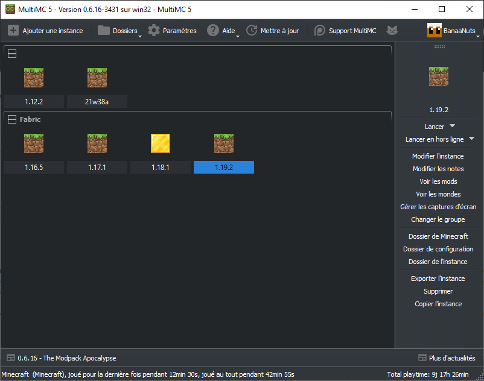

# MultiMC

**"Manage Minecraft instances with ease"**

MultiMC est un launcher alternatif créé pour répondre aux problèmes dont souffre le launcher officiel proposé par Mojang. Le launcher officiel marche à peu près bien tant qu'on ne joue qu'à une seule version. Or avec Minecraft, contrairement à beaucoup de jeu, on est amené à manipuler différentes versions: jouer en 1.18.2, puis en beta 1.7.3 en passant par la 1.2.5: c'est possible ! Seulement il y a un hic: si cela est supporté par le launcher officiel, ce n'est pas ce qu'il y a de plus optimisé... Un gros problème est que les dossiers `resourcepacks` (anciennement `texturepacks`), `saves`, `mods`, etc. sont partagés entre toutes les versions. Cela cause des soucis en naviguant entre les versions. Ce n'est pas pratique puisque par exemple, si on alterne souvent entre les versions 1.16.5 et 1.18.2 par exemple, et que l'on joue avec des mods, il faut à chaque fois changer les fichiers du dossier `mods`.  

Une solution serait de pouvoir créer une (ou même plusieurs) instance(s) séparée(s) pour chaque version, avec chacune ses propres dossiers. C'est ce que propose MultiMC ! En plus de cela, MultiMC propose une installation simplifiée de Fabric ou Forge, une gestion de la RAM par instance ou de manière globale, une interface intuitive et plus encore.

## Installation

1. **Téléchargement de MultiMC.** Téléchargez MultiMC à [cette adresse](https://multimc.org/#Download) en veillant à sélectionner la version pour votre système d'exploitation (Windows 32/64 bits le plus souvent).  

2. **Extraction du fichier.** Localisez le fichier téléchargé, si vous avez opté pour la version Windows, il s'appelle `mmc-stable-win32.zip`. Clique droit sur le fichier > `Extraire tout...` > `Extraire`.  

3. **Déplacement du dossier.** Dans le dossier `mmc-stable-win32` créé, prenez le dossier `MultiMC` et mettez-le dans le dossier **Programmes** situé à la racine du dossier système. Pour cela: ouvrez l'explorateur de fichier, sur la gauche ouvrez `Ce PC` puis le disque `Windows`. Le dossier `Programmes` est situé là.  

4. **Création du raccourci.** Ouvrez le dossier `MultiMC`, localisez le fichier `MultiMC.exe` > clique droit > `Créer un raccourci`. Déplacez le raccourci créé sur le bureau.

5. **Installation de Java.** Minecraft nécessite Java pour fonctionner. Il est inclus dans le launcher officiel, mais pas dans MultiMC. Lancez MultiMC > `Paramètres` > `Java` > `Détécter automatiquement`. Une liste s'affiche: si Java version **17** ou supérieur est présent, sélectionnez-le. Sinon, téléchargez Java 17 depuis [ce lien](https://www.oracle.com/java/technologies/downloads/#jdk17-windows) puis en cliquant sur `x64-Installer`: installez Java en double-cliquant sur le fichier téléchargé. Une fois fait, revenez dans MultiMC et sélectionnez Java 17.

6. **Allouer plus de RAM** La procédure décrite [ici](optimisation.md#autres-optimisations) pour allouer plus de RAM à Minecraft est simplifiée: dans MultiMC, accédez à `Paramètres` > `Java` et modifiez la valeur de `Allocation maximale de mémoire` pour la mettre à `2048 MiB`, ou plus si votre machine le permet.  

    !!! attention

        Ne jamais allouer plus que la moitié de la RAM installée sur la machine !

## Utilisation

Une fois MultiMC installé, vous pouvez créer des instances pour chaque "cas d'utilisation" de Minecraft: quand vous jouez en 1.18.2, quand vous jouez en 1.19.2 avec des mods, quand vous jouez en 1.19.2 sans mods, etc. Pour créer une instance, cliquez sur `Ajoutez une instance`. Séléctionnez la version de votre choix. Une fois créée, vous pouvez cliquer sur l'instance puis sur `Modifier l'instance`: c'est là que la magie opère ! De là vous pouvez tout faire: installer des mods, des resource packs, des mondes, consulter les captures d'écran, etc. Quelque chose de particulièrement utile: depuis l'onglet `Version` vous pouvez installer Fabric très simplement en cliquant sur `Installer Fabric` !
