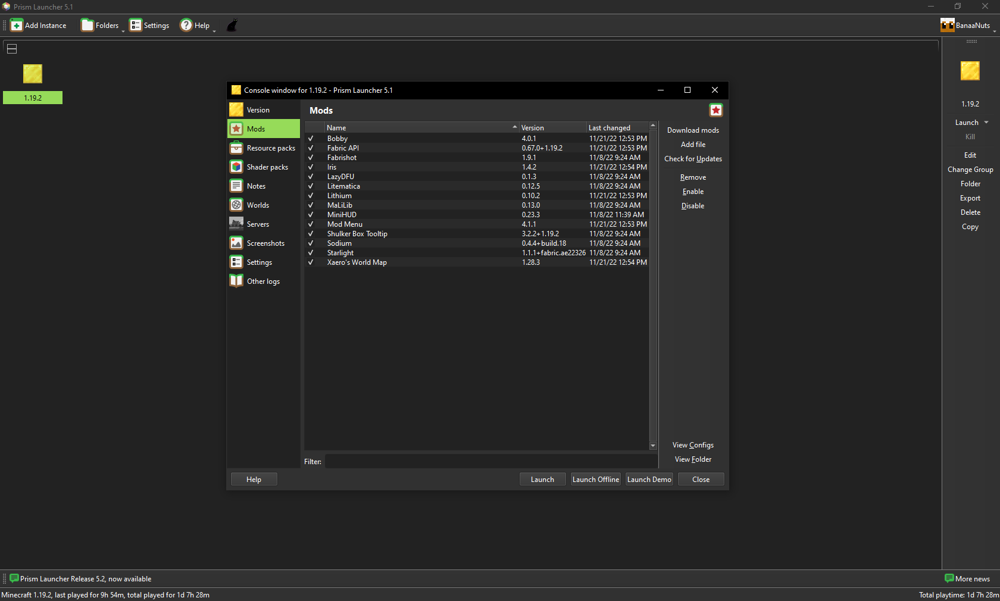

# Prism

**"Manage Minecraft instances with ease"**

Prism est un launcher alternatif, fork du controversé PolyMC lui-même fork du célèbre MultiMC, créé pour répondre aux problèmes dont souffre le launcher officiel proposé par Mojang. Le launcher officiel marche à peu près bien tant qu'on ne joue qu'à une seule version. Or avec Minecraft, contrairement à beaucoup de jeu, on est amené à manipuler différentes versions: jouer en 1.18.2, puis en beta 1.7.3 en passant par la 1.2.5: c'est possible ! Seulement il y a un hic: si cela est supporté par le launcher officiel, ce n'est pas ce qu'il y a de plus optimisé... Un gros problème est que les dossiers `resourcepacks` (anciennement `texturepacks`), `saves`, `mods`, etc. sont partagés entre toutes les versions. Cela cause des soucis en naviguant entre les versions. Ce n'est pas pratique puisque par exemple, si on alterne souvent entre les versions 1.16.5 et 1.18.2 par exemple, et que l'on joue avec des mods, il faut à chaque fois changer les fichiers du dossier `mods`.  

Une solution serait de pouvoir créer une (ou même plusieurs) instance(s) séparée(s) pour chaque version, avec chacune ses propres dossiers. C'est ce que propose Prism ! En plus de cela, Prism propose une installation simplifiée de Fabric ou Forge, une gestion de la RAM par instance ou de manière globale, une interface intuitive et plus encore. Et ajout bienvenu par rapport à son prédécesseur MultiMC: l'installation de mods est ultra simplifiée ! En choisissant dans le catalogue de mods proposés (tirés des sites Modrinth et CurseForge) et en un clic, tout les mods que vous désirez sont téléchargés et installés ! La mise à jour de ceux-ci est également prise en charge. Conclusion: tout ou presque peut se faire depuis le launcher directement sans naviguer sur 10000 sites.

## Installation

1. **Téléchargement de Prism.** Téléchargez Prism à [cette adresse](https://prismlauncher.org/download/) en veillant à sélectionner la version exécutable `.exe` pour Windows.  

2. **Installation de Prism.** Double-cliquez sur le fichier en `.exe` que vous venez de télécharger et suivez le processus d'installation.  

3. **Installation de Java.** Minecraft nécessite Java pour fonctionner. Il est inclus dans le launcher officiel, mais pas dans Prism. Lancez Prism > `Paramètres` > `Java` > `Détécter automatiquement`. Une liste s'affiche: si Java version **17** ou supérieur est présent, sélectionnez-le. Sinon, téléchargez Java 17 depuis [ce lien](https://adoptium.net/) puis en cliquant sur `Latest LTS release`: installez Java en double-cliquant sur le fichier téléchargé. Une fois fait, cliquez sur `Actualiser` et sélectionnez Java 17.

4. **Allouer plus de RAM** La quantité de RAM allouée de base dans Prism doit être suffisante en théorie. Si c'est le cas, ignorez cette étape. Malgré tout si elle n'est pas suffisante, vous pouvez l'augmenter: 2048 MiB pour 4GB de RAM au total, et 4096 MiB pour 16GB. La procédure décrite [ici](optimisation.md#autres-optimisations) pour allouer plus de RAM à Minecraft est simplifiée: dans Prism, accédez à `Paramètres` > `Java` et modifiez la valeur de `Allocation maximale de mémoire` pour la mettre à `2048 MiB`, ou plus si votre machine le permet.  

    !!! attention

        Ne jamais allouer plus que la moitié de la RAM installée sur la machine !

5. **Connection à votre compte Minecraft.** Dans Prism, cliquez sur le bouton tout en haut à droite puis sur `Configurer les comptes`. Ensuite cliquez sur `Ajouter un compte Microsoft` et laissez-vous guider.  

## Utilisation

Une fois Prism installé, vous pouvez créer des instances pour chaque "cas d'utilisation" de Minecraft: quand vous jouez en 1.18.2, quand vous jouez en 1.19.2 avec des mods, quand vous jouez en 1.19.2 sans mods, etc. Pour créer une instance, cliquez sur `Ajoutez une instance`. Séléctionnez la version de votre choix. Une fois créée, vous pouvez cliquer sur l'instance puis sur `Modifier l'instance`: c'est là que la magie opère ! De là vous pouvez tout faire: installer des mods, des resource packs, des mondes, consulter les captures d'écran, etc. Quelque chose de particulièrement utile: depuis l'onglet `Version` vous pouvez installer Fabric très simplement en cliquant sur `Installer Fabric` ! Une fois le modloader installé (Fabric ou Forge) vous pouvez installer des mods directement depuis Prism, comme les mods d'optimation du [fameux guide associé !](optimisation.md) Pour cela: depuis le menu d'une instance: `Editer` > `Mods` > `Télécharger`: magie ! Une fois dans le menu de téléchargement des mods, sélectionnez le catalogue de mods (Modrinth ou Modrinth) que vous souhaitez et cherchez des mods. Vous pouvez télécharger des mods depuis les deux catalogues: CurseForge est le leader historique, vous y trouverez sûrement tout ce que vous voulez. Modrinth est un nouvel arrivant, privilégié de plus en plus par les modders, il est voué à dépasser CurseForge dans les années à venir.