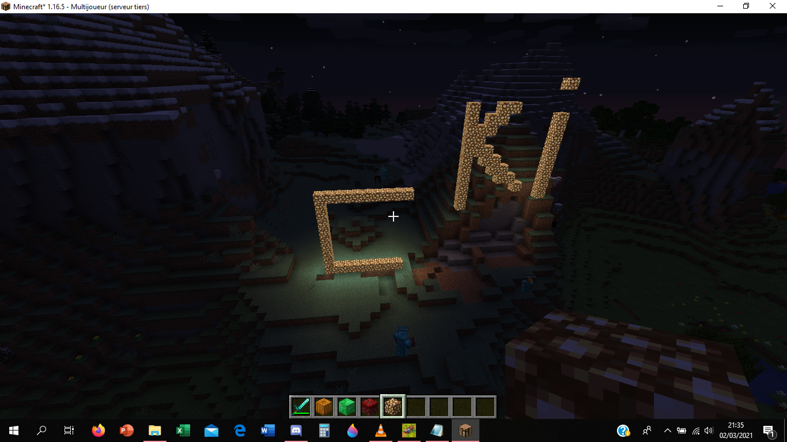

# Plugins & autres  

Un plugin est un mod pour serveur utilisant le logiciel serveur Bukkit ou un de ses dérivés (Spigot, Paper, Purpur, etc.). C'est le cas de ChômageLand, qui dispose par ailleurs de plusieurs plugins.  

Un datapack est un type de mod qu'il est possible d'associer à un monde Minecraft en particulier pour en modifier le comportement. Ce type de mod, moins poussé que les autres, est supporté nativement par Minecraft et leur installation est très simple. Le monde survie de ChômageLand en possède plusieurs.

Cette page liste également les spécifications techniques en vrac du serveur ainsi qu'un historique.  

## Plugins

* `DiscordSRV`  
Assure la liaison entre le serveur Minecraft et le serveur Discord.  

* `Multiverse-Core` `Multiverse-Inventories` `Multiverse-NetherPortals`  
Implémente le système de mondes multiples et régule les intéractions entre ceux-ci.  

* `LuckPerms`  
Gestion des permissions.  

* `DriveBackupV2`  
Gestion des backups: upload quotidien d'un backup des mondes vers [ce dossier GDrive](https://drive.google.com/drive/folders/1Im9VETo0Q1LFncT_OWrib8QMgdzM0Oz-?usp=sharing).  

* `SimpleTPA`  
Ajout du `/tpa` pour se téléporter à un joueur.  

* `TAB`  
Personnalisation du menu TAB.  

* `Maintenance`  
Gestion des maintenances.  

## Datapacks

* `Anti Enderman Grief - Vanilla Tweaks`  
Empêche les endermen de manipuler les blocs.  

* `Multiplayer Sleep - Vanilla Tweaks`  
Permet à un seul joueur de faire passer la nuit lorsque plusieurs personnes sont connectées.  

* `Fast Leaf Decay - Vanilla Tweaks`  
Les feuilles des arbres disparaissent plus vite.  

* `Graves - Vanilla Tweaks`  
Une tombe apparaît à la mort d’un joueur avec tout son stuff à l’intérieur.  

* `Villager Workstation Highlights - Vanilla Tweaks`  
Permet de trouver la workstation de n’importe quel villageois.  

* `AllMobsHeads`  
Datapack ajoutant une tête pour tous les mobs du jeu (et plus !): ils ont tous une probabilité de la dropper à leur mort, attrapez-les toutes !  

* `Durability Ping`  
Alerte le joueur quand une des ses pièces d'armure ou de ses outils est proche de casser.  

## Spécifications techniques  

* **Hébergeur**: PebbleHost - Formule Budget - 4GB  
* **Logiciel serveur**: Purpur 1.19.2 (Build 1825)  
* **Taille du monde survie**: 3,05 GiB (*au 2022-08-31*)  
* **Seed du monde survie**: `-3096418578045786467`  
* **Difficulté**: Normale  
* **Distance de rendu**: 12 chunks  

## Historique  

* **2022-10-20:** Mise à jour de logiciel serveur (Purpur 1.19.2 build 1825)
* **2022-10-0X:** Début de la deuxième phase de creusage du périmètre (couches 0-5)  
* **2022-09-20:** Ligne 1 du métropolitain achevée  
* **2022-09-13:** Premier tronçon du métropolitain terminé (Centre-ville <-> Vieux-chêne)  
* **2022-09-02:** Début de la construction du métropolitain  
* **2022-08-31:** Changement de version (Purpur 1.19.2 build 1770)  
* **2022-08-16:** Acquisition du nom de domaine `chomageland.fr`, lancement officiel  
* **2022-08-10:** Création du site Web officiel  
* **2022-07-23:** Création et lancement du serveur Discord  
* **2022-07-22:** Début du projet de métropolitain  
* **2022-01-17:** Lancement du Multiverse  
* **2022-01-06:** Changement de version (Purpur 1.18.1)  
* **2021-08-08:** Changement de logiciel serveur (Fabric 1.16.5)  
* **2021-05-0X:** Fin de la première phase de creusage du périmètre (couches 5-64)  
* **2021-04-16:** Début du projet de périmètre (trou de 16*16 chunks)  
* **2021-03-02 21h07:** Lancement du serveur (Paper 1.16.5)  
* **2021-03-02 19h57:** Stessy propose de nommer le serveur en référence à Pôle Emploi
* **2021-03-02 15h45:** Idée de serveur proposée sur Discord  


Tout premier screenshot posté sur le groupe *on peut tout couper* le 2022-03-02 à 21h35.  

### Messages de la première soirée du serveur

Messages postés sur le groupe Discord *on peut tout couper* dans la soirée du 2 mars 2021.

=== "HTML (avec images et mise en forme)"

    [Cliquez-ici](_snippets/discord_msg_premiere_journee.html) pour accéder à la version imagée et mise en forme.

=== "TXT (brut)"

    ``` title="Messages de la première soirée sur Minecraft"
    --8<-- "msg_discord_premiere_soiree.txt"
    ```