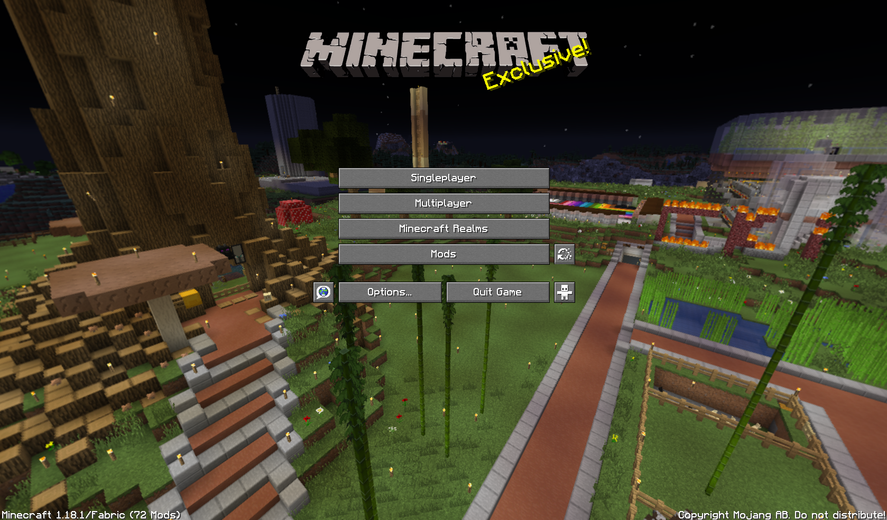
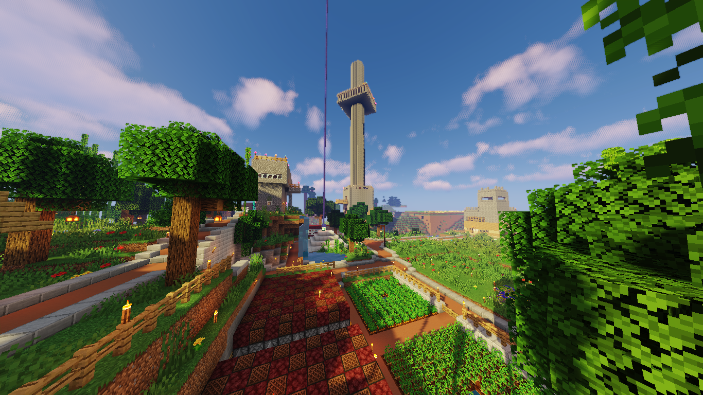

# Ressources  

Quelques ressources utiles à consulter ou à télécharger sur le serveur ou sur Minecraft en général.  

## Resource packs ChômageLand  

Quelques petits resource packs customs à l'éffigie du serveur ChômageLand. Ces packs modifient uniquement l'écran d'accueil du jeu, plus précisément le décors de fond qui tourne. Le pack existe en 6 variations:  

- Village au loin  
- Périmètre  
- Château de face  
- Arbre de face  
- Bites 1  
- Bites 2  

Pour installer un pack: click droit sur un des packs > Télécharger. A partir du fichier téléchargé > Extraire tout. Prendre le dossier contenu dans le dossier extrait et le placer dans le dossier `saves` de votre dossier `.minecraft` (:material-microsoft-windows: + `R` > `%appdata%`). Dans Minecraft: sélectionner le pack dans les paramètres, le placer tout en haut de la liste.

[:material-folder-google-drive: Resource packs ChômageLand](https://drive.google.com/drive/folders/16VjUaub_f7IRAyawexMIoqv6yNu25Rk1?usp=sharing){ .md-button .md-button--primary }  

## Captures d'écran  

Dossier regroupant différentes captures d'écran du serveur.  

[:material-folder-google-drive: Captures d'écran ChômageLand](https://drive.google.com/drive/folders/1s-HHEOIIntSsore7n8LR6tjQgS2yB78T?usp=sharing){ .md-button .md-button--primary }  

## YouTube  

### Playlist usines & co

Playlist de vidéos Minecraft d'usines ou de mécanismes utilisés ou à venir sur le serveur et autres vidéos utiles.  
<iframe width="560" height="315" src="https://www.youtube.com/embed/videoseries?list=PL1M7C_BxS_u24w1AUCqcvd_zrpaCJrmY5" title="YouTube video player" frameborder="0" allow="accelerometer; autoplay; clipboard-write; encrypted-media; gyroscope; picture-in-picture" allowfullscreen></iframe>  

### Youtubers

Quelques chaînes YouTube intéressantes pour s'informer ou se divertir:  

- **[AurélienSama][C1]** (FR)  
- **[AntVenom][C2]** (EN)  
- **[ilmango][C3]** (EN)  
- **[Shulkercraft][C4]** (EN)  
- **[SalC1][C5]** (EN)

[C1]: https://www.youtube.com/c/AurelienSama  
[C2]: https://www.youtube.com/c/AntVenom  
[C3]: https://www.youtube.com/c/ilmango  
[C4]: https://www.youtube.com/c/Shulkercraft  
[C5]: https://www.youtube.com/c/SalC1  
## Mods & co  

Différents sites ou trouver des mods, des resources packs, des maps, des datapacks, et tout ce dont vous voulez pour pimper votre Minecraft.  

- **[Curseforge][D1]:** énorme catalogue de mods, modpacks, resource packs, maps,...  
- **[Modrinth][D2]:** catalogue plus récent de mods et modpacks.  
- **[Vanilla Tweaks][D3]:** catalogue de micro resource packs et datapacks pour corriger ces petits détails qui vous chiffonnent.  

[D1]: https://www.curseforge.com/minecraft/mc-mods  
[D2]: https://modrinth.com/mods  
[D3]: https://vanillatweaks.net/  

## Sites utiles  

- **Le wiki Minecraft ([EN][E1]/[FR][E2]):** gigantesque wiki regroupant quantité d'informations sur le jeu, du nombre de point de vie d'un zombie à la liste des biomes du jeu en passant par la liste des changements apportés en version Infdev 20100227-1: il y a de quoi y passer des heures. Le wiki compte 8263 pages au 25 août 2022, et est disponible en anglais et en français, la version anglaise est cependant recommandée car plus complète.  
- **[Minecraft Tools][E3]:** site proposant divers outils forts utiles comme un aspirateur de skin, un générateur de mobs personnalisés, une gallerie de bannières, et bien d'autres.  
- **[Gamersgeeks Minecraft][E4]:** une section du site Gamersgeeks dédié à Minecraft. Section très fournie proposant plein de générateurs de tout et n'importe quoi (commandes, bannières,...).  
- **[MCstacker][E5]:** générateur de commande extrêmement poussé, proposant une aide pour la construction de commandes potentiellement complexes.  
- **[Plotz][E6]:** générateur de cercle, élipses, boules, sphères, tores.  
- **Subreddits:** [r/Minecraft][E7], [r/Minecraftbuilds][E8].  

[E1]: https://minecraft.fandom.com/wiki/Minecraft_Wiki  
[E2]: https://minecraft.fandom.com/fr/wiki/Minecraft_Wiki  
[E3]: https://minecraft.tools/fr/  
[E4]: https://www.gamergeeks.net/apps/minecraft/  
[E5]: https://mcstacker.net/  
[E6]: https://www.plotz.co.uk/  
[E7]: https://www.reddit.com/r/Minecraft  
[E8]: https://www.reddit.com/r/Minecraftbuilds  

## Autres sites  

- **[Discontinued Features Wiki][F1]:** wiki des fonctionnalités et bugs disparus du jeu.  
- **[Omniarchive][F2]:** organisation d'archivage des anciennes versions de Minecraft, pour beaucoup absentes du launcher.  
- **[BetaCraft][F3]:** launcher alternatif ajoutant un support avancé des anciennes versions de Minecraft: plus de versions disponibles par rapport au launcher officiel, corrections de bugs affectant les anciennes versions sur le launcher officiel, support des skins, des serveurs, etc.

[F1]: https://mcdiscontinued.miraheze.org/wiki/Main_Page  
[F2]: https://omniarchive.org/
[F3]: https://betacraft.uk/